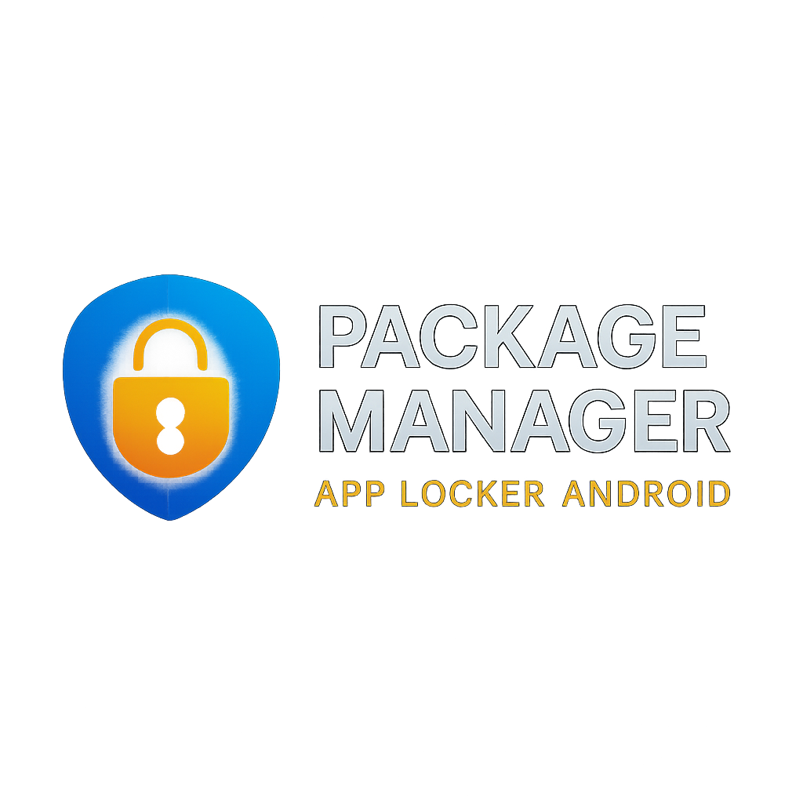
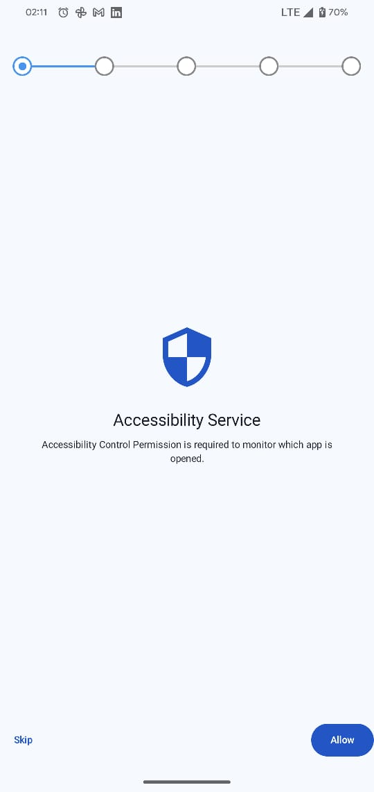
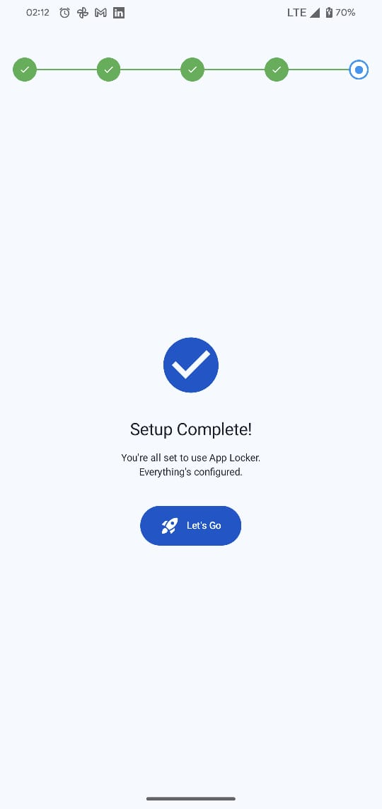
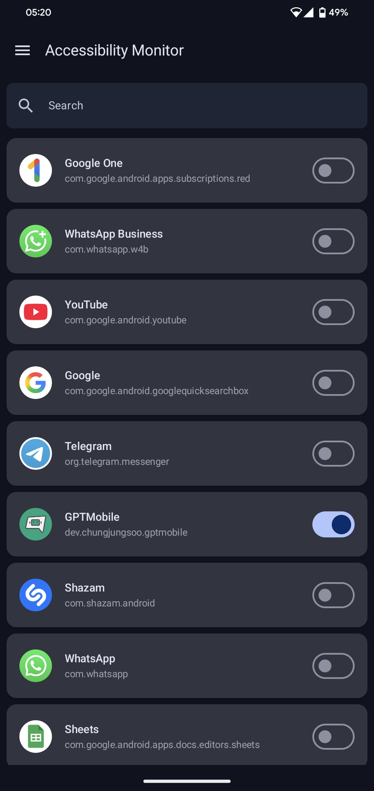
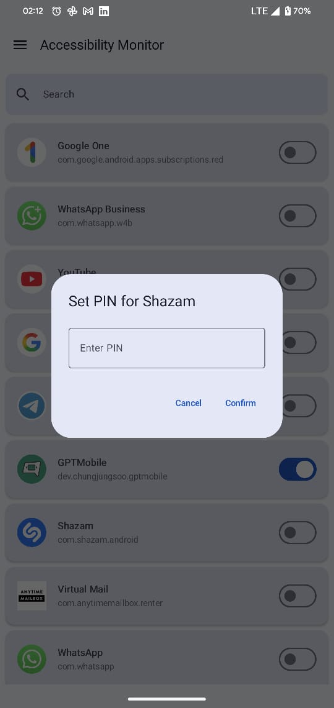
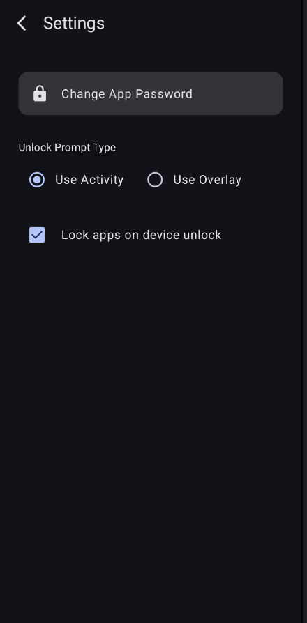
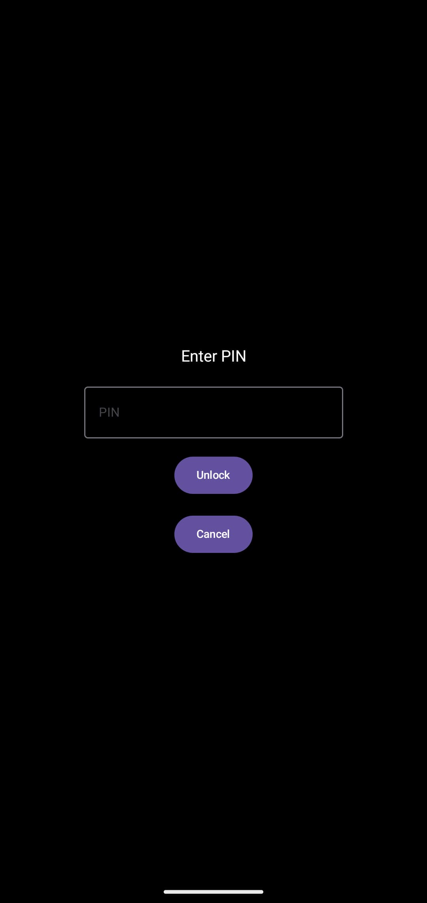

<p >
  
</p>

# 📦 Package Manager Android (App Locker)


---

**Package Manager Android** is a native Kotlin-based **App Locker application** built using the latest Android development best practices. It allows users to securely lock selected applications on their device using a custom PIN, enhancing privacy and control over app access.

---

## 🔐 Key Features

- 🧭 **New Onboarding Flow** – step-by-step setup with a clickable progress bar UI
    - Step 1: Allow Accessibility Service Permission
    - Step 2: Allow “Draw over other apps” Permission
    - Step 3: Set Up App PIN
    - Step 4: Configure Preferences
    - Step 5: Setup Completed Screen (navigates to app)
- 📱 **Installed Apps Listing** – lists user and system apps using Launcher Intent & PackageManager
- 🔒 **Lock Any App** with a custom PIN
- 🧩 **Custom Lock Screen** (Composable PIN UI) or Floating ScreenOverlay
- 🕒 **Auto Re-lock After 5 Minutes** of inactivity or screen off
- 🧠 **Smart Runtime Caching** for better performance & responsiveness
- 🛡️ **Accessibility Service Monitoring** for real-time app launch detection
- 🎛️ **Settings Panel** – Switch between LockScreen or Overlay Prompt, manage app unlock behavior
- 🗄️ **Persistent Storage** with Room database for locked apps
- 🔄 **Lifecycle-aware Inactivity Timer** using coroutines and flows
---

## 🧪 Tech Stack & Architecture

This project is built using **modern Android Jetpack libraries** and a scalable **MVVM Clean Architecture**.

### 🛠 Technologies Used

- **Language**: Kotlin
- **UI Framework**: Jetpack Compose (Material 3)
- **Architecture**: MVVM + Clean Architecture Principles
- **State Management**: Compose States + `StateFlow`, `SharedFlow`
- **Dependency Injection**: Dagger Hilt
- **Local Storage**: Room Database
- **App Monitoring**: Accessibility Service
- **Coroutines**: Inactivity timeout, lifecycle-aware flows
- **Theming**: Dark/Light mode support with dynamic logo

---

## 📱 Screens Overview

| Feature                       | Description                                                                        |
|-------------------------------|------------------------------------------------------------------------------------|
| 🚀 **Onboarding Flow**        | Guides user through permission setup, PIN creation, and preference settings        |
| 📊 **Step Progress Bar**      | Visually tracks onboarding steps; each step is clickable and interactive           |
| 🔍 **App List Screen**        | Displays all installed apps using Launcher Intent, supports system apps too        |
| 🔐 **Lock Screen**            | Asks for PIN using a composable UI; fallback to Overlay Dialog supported           |
| ⚙️ **Settings Screen**        | Configure lock behavior (e.g., use overlay or activity, re-lock options)           |
| 🕵️‍♂️ **Background Service** | Monitors foreground app launch using Accessibility Service                         |

---

## 📦 Architecture Diagram (MVVM Flow)

```
AppListScreen / LockScreen
        ↓
   ViewModel (State & UI Logic)
        ↓
Repository (Data Coordination)
        ↓
 Room DB & DataStore + AppMonitorService
```

---

## 📸 Screenshots

| 🛡️ Onboarding (Allow Permission)                     | ✅ Onboarding (Setup Complete)                         | 📱 App List Screen |
|-------------------------------------------------------|--------------------------------------------------------|---------------------|
|  |  |  |

| 🔒 Lock App                                           | ⚙️ Settings Screen                                     | 🔐 Lock Screen     |
|-------------------------------------------------------|--------------------------------------------------------|--------------------|
|      |       |  |

---

## ✅ Best Practices Demonstrated

- Composable lifecycle and recomposition-aware state handling
- Clean dependency separation with Hilt modules
- Navigation with proper back-stack and screen transition handling
- Performance optimization using runtime memory cache
- Secure lock screen behavior using Android best practices

---

## 🧪 How It Works

- App starts with an interactive **Onboarding Flow** using a step progress UI.
- Steps include:
    1. Allow Accessibility Permission
    2. Allow “Draw over other apps” Permission
    3. Set custom App PIN
    4. Choose Preferences
    5. Final screen confirms setup is complete and navigates to main app
- User selects apps to lock from the App List screen.
- Accessibility Service continuously monitors foreground app launch.
- If a locked app is launched:
    - User is prompted with LockScreen or a floating Overlay PIN dialog.
    - If validated, the app is unlocked for 5 minutes or until screen off.
- A background inactivity timer ensures re-locking behavior.

---

## 📁 Folder Structure Overview

```
├── ui/               → Compose screens (Onboarding, AppList, LockScreen, Settings)
├── viewmodel/        → ViewModels with StateFlows
├── data/             → Repositories and Room database
├── di/               → Hilt modules for dependency injection
├── service/          → AccessibilityService to monitor apps
├── utils/            → Timer, cache, helpers
```

---

## 🚀 Getting Started

1. Clone the repo:
   ```bash
   git clone https://github.com/your-username/package-manager-android.git
   ```
2. Open in Android Studio (Hedgehog or newer)
3. Run on an Android device (API 29+)
4. Enable Accessibility Permission for the app
5. Set your custom PIN and start locking apps!

---

## 📌 Permissions Required

- **QUERY_ALL_PACKAGES** (Android 11+) – To list system apps
- **Accessibility Service** – To monitor app launches
- **Foreground Service** – For tracking app usage in background (optional)
- **Draw Over Other Apps** – Required for displaying floating ScreenOverlay (PIN prompt)
- **KILL_BACKGROUND_PROCESSES** – Used to force-stop apps when needed after failed unlock attempt

---

## 👨‍💻 Author

**Munib Hamza**  
📱 Mobile App Consultant | Android Specialist  
[LinkedIn](https://www.linkedin.com/in/munib-hamza/) | [Upwork](https://www.upwork.com/freelancers/~01f33c5ea877b17eb1) | [GitHub](https://github.com/munibhamza)

---

## 📄 License

This project is open-source under the [MIT License](LICENSE).
